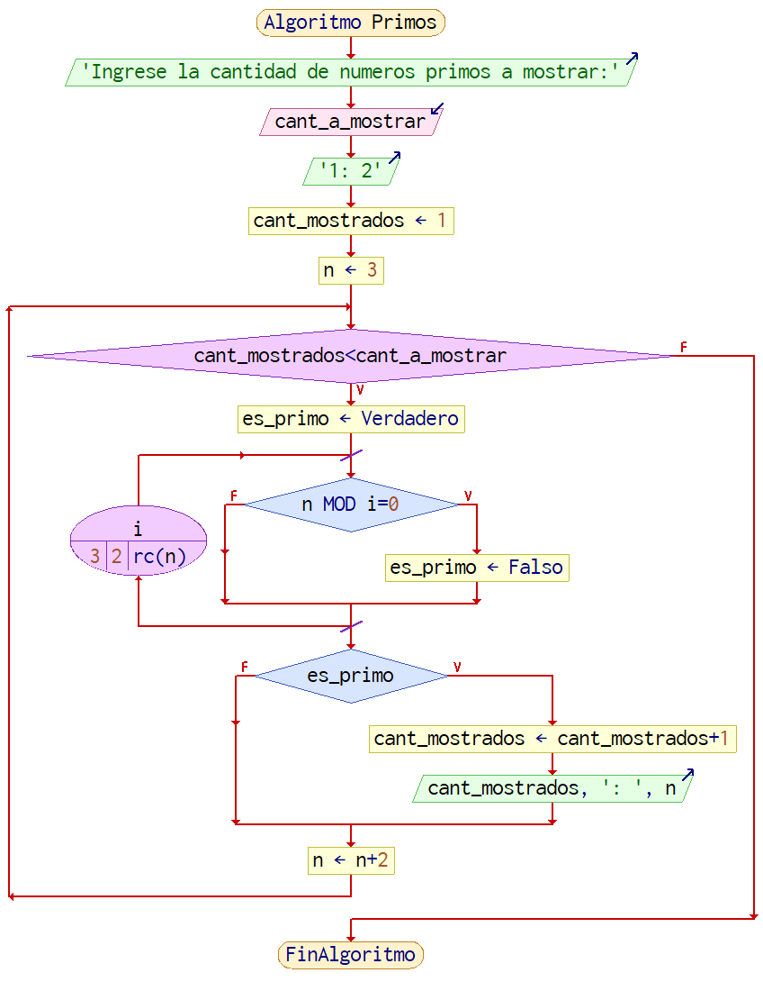

# If_u_blink_fast_this_will_look_like_a_original_work
## Reto 3
<pre>
  Algoritmo Primos
	Escribir 'Ingrese la cantidad de numeros primos a mostrar:'
	Leer cant_a_mostrar
	Escribir '1: 2'
	cant_mostrados <- 1 // el primer primo es 2, los otros son todos impares...
	n <- 3
	Mientras cant_mostrados<cant_a_mostrar Hacer // ...a partir de 3
		es_primo <- Verdadero
		Para i<-3 Hasta rc(n) Con Paso 2 Hacer // pienso que es primo hasta que encuentre con que dividirlo
			Si n MOD i=0 Entonces // ya sabemos que es impar
				es_primo <- Falso // si la division da exacta...
			FinSi // ...ya no es primo
		FinPara
		Si es_primo Entonces
			cant_mostrados <- cant_mostrados+1
			Escribir cant_mostrados, ': ', n
		FinSi
		n <- n+2
	FinMientras
FinAlgoritmo
</pre>

